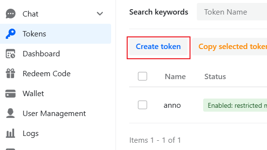

<p align="right">
   <strong>English</strong> | <a href="./README_zh-CN.md">中文</a>
</p>

# scAnno                                                  

Automatic annotation of single cell sequencing data based on large language model for fast and accurate cell type identification.

## 🧬 Function

-  **Compatible with OpenAI API format**
-  **Multi-model support**：Support DeepSeek-r1, o1, Claude-3.5 and other series models.
- **Parallel acceleration**：Parallel acceleration is achieved by setting `works` according to the CPU core setting of the computer.

Function function is **`anno`**, through passing the marker-genes and background information, let AI judge the cell type (subtype), the return result is a list, the first list is`smartAnno `: store the status of the request and the related information returned by AI; The second list is `anno` : Extract the AI comment results, the first column is Cluster, the second column is Celltype(subtype).

## Install

```R
# Step 1: install devtools
install.packages("devtools")
library(devtools)

# Step 2: install scAnno
devtools::install_github("ParseqFlow/smartAnno", build = TRUE)
```


## Tutorials

1. Get the API-KEY（Thank you [NBchat API](https://newapi.nbchat.site/))support）

   - Create API-KE

     

   - Copy it

     

2. Fill in the variable (the key provided free of charge, and if the limit is used up, please go to [NBchat](https://newapi.nbchat.site/) to create）

   ``` R
   Sys.setenv(API_URL = "https://newapi.nbchat.site/v1/chat/completions")
   Sys.setenv(API_KEY = "sk-2nVFX8OZiAcOt8NNA21HX4EhZs7aiZsEol125ZqYjwT3E8zo") 
   ```

3. Run

   ``` R
   markers <- FindAllMarkers(object = scRNA,
                             test.use="wilcox" ,
                             only.pos = TRUE,
                             logfc.threshold = 0.25)  
   #  Or use the sample data provided by the project
   markers=read.csv("data/all_DEG.csv",row.names = 1)
   ann <- anno(
      markers,
      selected_clusters = c("0","1"),
       model = "deepseek-r1-250120", # Other models：o1、claude-3.5
      background = "Human peripheral blood single-cell data",
      workers = 6,
      time_out = 200 #Set the timeout period. Some apis have poor quality and take a long time to return. You are advised to replace high-quality apis
    )

   
- Run result screenshot
   
     
   
     


