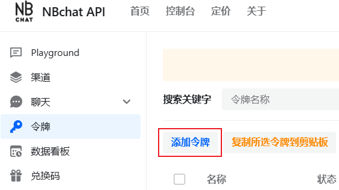

<p align="right">
   <strong>中文</strong> | <a href="./README.md">English</a>
</p>

# smartAnno 

基于大语言模型的单细胞测序数据自动注释解决方案，实现快速准确的细胞类型鉴定。

## 🧬 功能

-  **兼容OpenAI的API格式**
-  **多模型支持**：支持DeepSeek-r1、o1、Claude-3.5等系列模型。
- **并行加速**：通过设置`works`实现并行加速，根据电脑CPU核心设置  。

功能函数是`anno`,通过传入marker-genes和背景信息,让AI判断细胞类型（亚型），返回结果是个列表，第一个列表是`smartAnno`：存储请求状态及AI返回的相关信息；第二个列表是`anno`：提取AI的注释结果，第一列是Cluster，第二列是Celltype(亚型)。

## 安装

```R
# 1: 安装 devtools
install.packages("devtools")
library(devtools)

# 2: 安装scAnno
devtools::install_github("ParseqFlow/smartAnno", build = TRUE)
```


## 教程

1. 获取API-KEY（感谢[NBchat API](https://newapi.nbchat.site/))的支持）

   - 创建令牌

     

   - 复制令牌

     

2. 填写变量（该key免费提供，如果额度用完请去[NBchat](https://newapi.nbchat.site/)创建）

   ``` R
   Sys.setenv(API_URL = "https://newapi.nbchat.site/v1/chat/completions")
   Sys.setenv(API_KEY = "sk-2nVFX8OZiAcOt8NNA21HX4EhZs7aiZsEol125ZqYjwT3E8zo") 
   ```

3. 运行分析

   ``` R
   markers <- FindAllMarkers(object = scRNA,
                             test.use="wilcox" ,
                             only.pos = TRUE,
                             logfc.threshold = 0.25)  
   # 或者使用项目提供的示例数据
   markers=read.csv("data/all_DEG.csv",row.names = 1)
   ann <- anno(
      markers,
      selected_clusters = c("0","1"),
      model = "deepseek-r1-250120", # 正在适配其他模型：o1、claude-3.5
      background = "人外周血单细胞样本，中文回答",
      workers = 6,
      time_out = 200 # 设置超时时间，某些API质量较差，返回时间较长，建议更换高质量API
    )
   
- 运行结果截图
   
  

  
 


